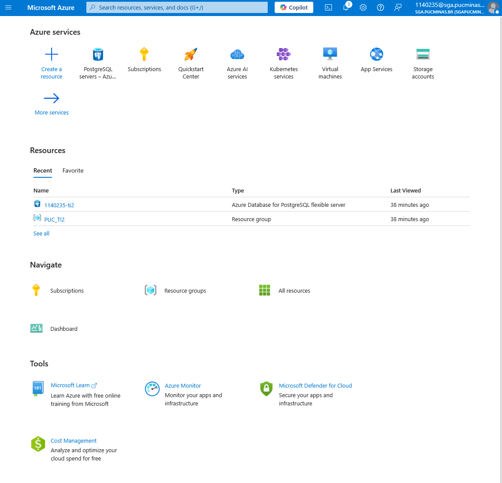
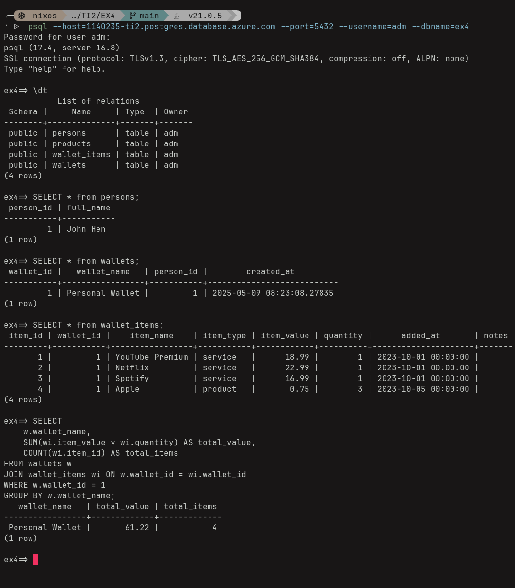
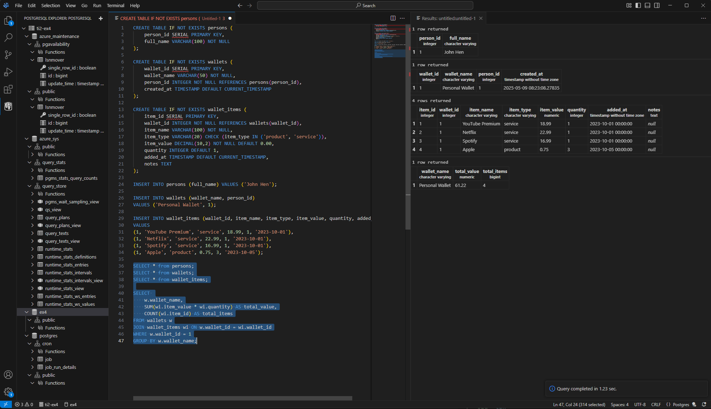
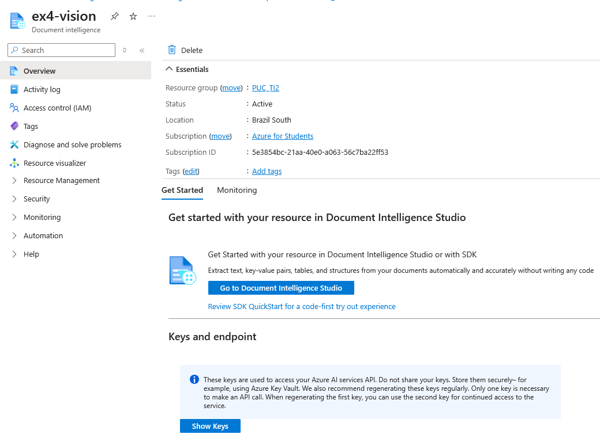

# Exercício 4 - Banco de Dados Azure e IA
## Estrutura de Projeto
```
📂 projeto/
├── 📄 readme.md                     # informaçoes gerais
├── 📄 document.pdf                  # PDF de entrada
├── 📄 PDFProcessor.java             # Código para AI-Vision
├── 📄 portal_azure.png              # imagem de acesso
├── 📄 database_select_query.png     # imagem de provando uso do database no azure.
├── 📄 ai-vision.png                 # imagem de acesso para as chaves de API do AI-Vision
└── 📄 resultado.json                # Saída gerada
```

## Parte 1: Conexão com Azure

### 1. Introdução aos Serviços Azure
Utilizando os serviços de banco de dados da Microsoft Azure, vide confirmaçao:

  

### 2. Criação do Banco de Dados
Criamos um banco de dados chamado `ex4` dentro de nossa instância `ti2-ex4` com a seguinte configuração:
- Tipo de servidor: PostgreSQL
- Conexao: Básico
- Região: Brazil South

### 3. Código SQL Utilizado
```sql
-- Criação das tabelas
CREATE TABLE IF NOT EXISTS persons (
    person_id SERIAL PRIMARY KEY,
    full_name VARCHAR(100) NOT NULL
);

CREATE TABLE IF NOT EXISTS wallets (
    wallet_id SERIAL PRIMARY KEY,
    wallet_name VARCHAR(50) NOT NULL,
    person_id INTEGER NOT NULL REFERENCES persons(person_id),
    created_at TIMESTAMP DEFAULT CURRENT_TIMESTAMP
);

CREATE TABLE IF NOT EXISTS wallet_items (
    item_id SERIAL PRIMARY KEY,
    wallet_id INTEGER NOT NULL REFERENCES wallets(wallet_id),
    item_name VARCHAR(100) NOT NULL,
    item_type VARCHAR(20) CHECK (item_type IN ('product', 'service')),
    item_value DECIMAL(10,2) NOT NULL DEFAULT 0.00,
    quantity INTEGER DEFAULT 1,
    added_at TIMESTAMP DEFAULT CURRENT_TIMESTAMP,
    notes TEXT
);

-- Adicionar algumas linhas nas tabelas
INSERT INTO persons (full_name) VALUES ('John Hen');

INSERT INTO wallets (wallet_name, person_id)
VALUES ('Personal Wallet', 1);

INSERT INTO wallet_items (wallet_id, item_name, item_type, item_value, quantity, added_at)
VALUES
(1, 'YouTube Premium', 'service', 18.99, 1, '2023-10-01'),
(1, 'Netflix', 'service', 22.99, 1, '2023-10-01'),
(1, 'Spotify', 'service', 16.99, 1, '2023-10-01'),
(1, 'Apple', 'product', 0.75, 3, '2023-10-05');


-- Query das tabelas
SELECT * from persons;
SELECT * from wallets;
SELECT * from wallet_items;

SELECT 
    w.wallet_name,
    SUM(wi.item_value * wi.quantity) AS total_value,
    COUNT(wi.item_id) AS total_items
FROM wallets w
JOIN wallet_items wi ON w.wallet_id = wi.wallet_id
WHERE w.wallet_id = 1
GROUP BY w.wallet_name;
```

### 4. Prova de Conexão Bem-sucedida

Consulta no Banco
Resultado da consulta SELECT mostrando os dados inseridos



ou utilizando a extensao PostgreSQL no vscode(e derivados).
  


## Parte 2: Utilização do Sistema de IA do Azure

### 1. Integração com Serviços Cognitivos
No Portal Azure:
Crie um recurso "Document Intelligence" (antigo Form Recognizer)
Anote Endpoint e Chave de API nas configurações conforme informadas na pagina de recurso. vide imagem
  

  
### 2. Definir credenciais localmente:
```bash
# Linux/macOS (adicionar ao ~/.bashrc ou ~/.zshrc para persistência)
export AZURE_ENDPOINT="https://<seu-endpoint>.cognitiveservices.azure.com/"
export AZURE_API_KEY="sua-chave-aqui"

# Windows (persistente via interface gráfica)
setx AZURE_ENDPOINT "https://<seu-endpoint>.cognitiveservices.azure.com/"
setx AZURE_API_KEY "sua-chave-aqui"
```

### 3. Executar o programa.

Utitilize o javac e java, para compilar e rodar o programa.
```sh
javac PDFProcessor.java
java PDFProcessor
```

### Códigos de Erro Comuns
| Código | Significado                           | Ação Recomendada                  |
|--------|---------------------------------------|-----------------------------------|
| 202    | Análise iniciada com sucesso          | Aguardar processamento            |
| 401    | Chave API inválida/inexistente        | Verificar variáveis de ambiente   |
| 429    | Limite de requisições excedido        | Reduzir frequência de chamadas    |
| 500    | Erro interno do servidor              | Tentar novamente mais tarde       |

O resultado do programa obtido de resposta do AI-Vision ficará salvo em resultado.json
